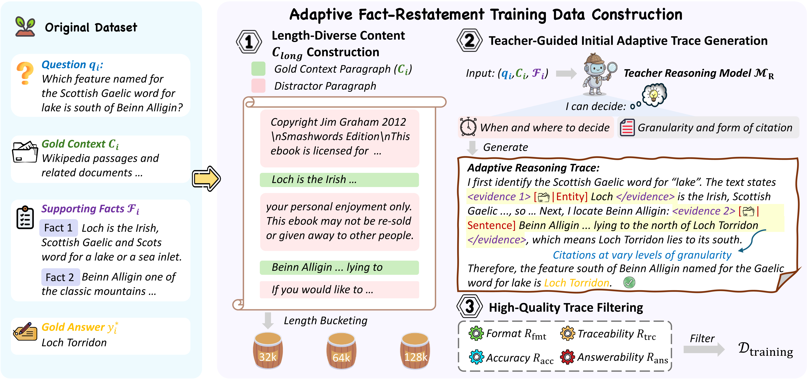

# REFACT: Fact Restatement for Compact and Faithful Chain-of-Thought Reasoning

Click the links below to view our papers, checkpoints:

<a href='https://arxiv.org/abs/2506.10822'></a><a href='https://huggingface.co/jinpu666/REFACT_Qwen3-4B'><a href='https://huggingface.co/jinpu666/REFACT_Qwen3-8B'></a>


# Overview

The pipeline starts from an original QA dataset containing source contexts, questions, supporting facts, and gold answers. A teacher reasoning model first generates adaptive fact-restatement traces by deciding when evidence is needed and how each cited fact should be expressed, allowing citations to appear as entities, phrases, or sentences rather than fixed-format fact copies. The generated traces are then filtered according to format validity, answer accuracy, source traceability, and evidence sufficiency, ensuring that the retained reasoning trajectories are both well-formed and genuinely grounded in the source context. To improve robustness in long-context settings, we further insert distractor paragraphs under target length buckets of 32k, 64k, and 128k, producing length-diverse instances that span practical long-context ranges. The final dataset is used to train models to generate compact, faithful, and citation-grounded reasoning trajectories.

# Set Up
**Use `git clone` to download this project**
```
git clone https://github.com/NEUIR/REFACT.git
cd REFACT
```
**To prevent conflicts between packages, we mainly use two virtual environment management packages, one for constructive data and evaluate、 one for model rl training.**

```
for constructive data and evaluate, please:
conda create -n eval python==3.10.0
conda activate eval
pip install -r requirements.txt

for model training, please:
conda create -n verl python==3.10.0
conda activate verl
pip install -r requirements_rl.txt

```

# Data Preparing
If you want to reproduce the process of constructing the reasoning trajectory of fact restatement from scratch, Please use the following command
```
cd data
bash run_data_pipeline.sh
```


# RL Training
Our GRPO training uses verl. Before use, please modify the model path and dataset path in the script below, as well as the output path for saving checkpoints. You can use our [data](https://huggingface.co/datasets/jinpu666/REFACT_RL) for training.
```
conda activate verl
cd verl
bash ./example/grpo_trainer/longtext/run_8b_ruler_cite.sh
```

# Evaluate
Our evaluation uses LongBench's and LVEval's evaluation methodology and we provide nothing but good test datasets. If you want to make any changes, please refer to the files under config.

Before evaluation, please first go to the [LVEval](https://github.com/infinigence/LVEval) and [LongBench](https://github.com/THUDM/LongBench) official website to download the corresponding dataset.
```
cd LongBench
python pred.py --model mode_name
python eval.py --model mode_name
```

```
cd LVEval
bash pred_vllm.sh model_path output_dir
bash eval.sh output_dir  
```

## Citation


```bibtex
@article{jin2026refact,
      title={REFACT: Aaptive Fact Restatement for Compact and Faithful Chain-of-Thought Reasoning},
      author={Jin, Zhensheng and Dai, Xin and Liu, Zhenghao and Xiao, Chaojun and Xie, Huiyuan and Gu, Yu and Yu, Ge and Sun, Maosong},
      year={2026}
      url={}, 
}
```
